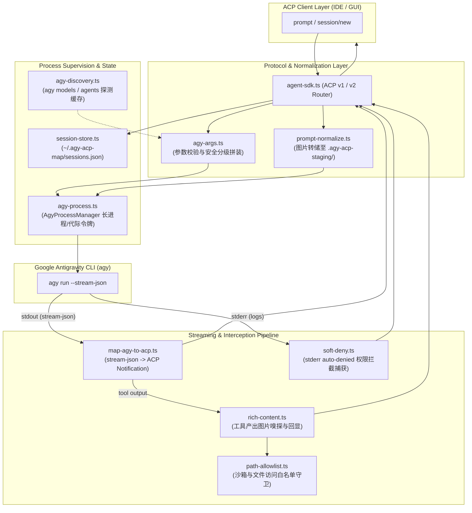

# `src/lib/` — 核心业务引擎与桥接库 (Core Engine)

本目录包含了 `agy-acp-map` 的全部**底层核心业务逻辑**。它与外层的 JSON-RPC 传输层协议外壳（如 [`src/agent-sdk.ts`](file:///d:/project/js/Electron/antigravity-acp/scratch/repos/yitom486-agy-acp-map/src/agent-sdk.ts)、[`src/sdk-server.ts`](file:///d:/project/js/Electron/antigravity-acp/scratch/repos/yitom486-agy-acp-map/src/sdk-server.ts)）完全解耦，专注于 Google Antigravity CLI (`agy`) 的进程生命周期管理、原生 `stream-json` 事件流双向翻译、安全白名单、软拒绝拦截与多模态富媒体处理。

所有模块均经过高内聚、低耦合的设计，配套完备的离线单元测试，支持毫秒级运行（`bun test src/lib`）。

---

## 核心架构与数据流 (Architecture & Data Flow)

整个核心引擎协作流程如下：



---

## 模块清单与职责划分

| 模块源码 | 配套单元测试 | 核心职责与关键能力 |
| :--- | :--- | :--- |
| [`map-agy-to-acp.ts`](file:///d:/project/js/Electron/antigravity-acp/scratch/repos/yitom486-agy-acp-map/src/lib/map-agy-to-acp.ts) | [`map-agy-to-acp.test.ts`](file:///d:/project/js/Electron/antigravity-acp/scratch/repos/yitom486-agy-acp-map/src/lib/map-agy-to-acp.test.ts) | **事件流翻译**：将 `agy` 的 `init`、`step_update`、`result` 等原始事件转换为 ACP 规范的 `agent_message_chunk`、`agent_thought_chunk`、`tool_call_update` 和 `usage_update`。 |
| [`agy-process.ts`](file:///d:/project/js/Electron/antigravity-acp/scratch/repos/yitom486-agy-acp-map/src/lib/agy-process.ts) | [`agy-process.test.ts`](file:///d:/project/js/Electron/antigravity-acp/scratch/repos/yitom486-agy-acp-map/src/lib/agy-process.test.ts) | **长进程监督**：维持长期常驻的 `stream-json` 子进程；利用代际令牌（generation tokens）防范旧事件污染；跨平台优雅停机（SIGINT → SIGTERM → Windows `taskkill`）。 |
| [`agy-args.ts`](file:///d:/project/js/Electron/antigravity-acp/scratch/repos/yitom486-agy-acp-map/src/lib/agy-args.ts) | [`agy-args.test.ts`](file:///d:/project/js/Electron/antigravity-acp/scratch/repos/yitom486-agy-acp-map/src/lib/agy-args.test.ts) | **命令行参数组装与校验**：安全分级（`safe` / `autonomous` / `autonomous-unsandboxed`）、动态工作区校验、自定义模型/预设注入与严格的 JSON-Schema 校验参数组合。 |
| [`soft-deny.ts`](file:///d:/project/js/Electron/antigravity-acp/scratch/repos/yitom486-agy-acp-map/src/lib/soft-deny.ts) | [`soft-deny.test.ts`](file:///d:/project/js/Electron/antigravity-acp/scratch/repos/yitom486-agy-acp-map/src/lib/soft-deny.test.ts) | **软拒绝与权限拦截**：在无头非交互模式下，实时抓取 CLI `stderr` 中的 `auto-denied` 错误，在回合结束时为用户生成清晰的 `permissions.allow` 修复建议。 |
| [`prompt-normalize.ts`](file:///d:/project/js/Electron/antigravity-acp/scratch/repos/yitom486-agy-acp-map/src/lib/prompt-normalize.ts) | [`prompt-normalize.test.ts`](file:///d:/project/js/Electron/antigravity-acp/scratch/repos/yitom486-agy-acp-map/src/lib/prompt-normalize.test.ts) | **多模态输入暂存**：针对 `agy` 的 stdin 仅接收文本的限制，将客户端传入的图片 Base64 暂存到 `.agy-acp-staging/` 目录，并在 Prompt 中合成文件引文；提供会话级别的安全清理机制。 |
| [`rich-content.ts`](file:///d:/project/js/Electron/antigravity-acp/scratch/repos/yitom486-agy-acp-map/src/lib/rich-content.ts) | [`rich-content.test.ts`](file:///d:/project/js/Electron/antigravity-acp/scratch/repos/yitom486-agy-acp-map/src/lib/rich-content.test.ts) | **富媒体输出回显**：提取工具调用及执行结果中的图片路径（PNG/JPEG/WebP/GIF/SVG），将本地 ≤2MB 的图片读取并编码为 ACP 标准的 `{ type: 'image', data: base64 }` 块进行前台回显。 |
| [`path-allowlist.ts`](file:///d:/project/js/Electron/antigravity-acp/scratch/repos/yitom486-agy-acp-map/src/lib/path-allowlist.ts) | [`path-allowlist.test.ts`](file:///d:/project/js/Electron/antigravity-acp/scratch/repos/yitom486-agy-acp-map/src/lib/path-allowlist.test.ts) | **路径安全白名单**：规范化并严格校验任何文件或图片读取路径，防止路径穿越（Path Traversal），限制仅在工作区根目录、附加目录或安全暂存目录下。 |
| [`agy-discovery.ts`](file:///d:/project/js/Electron/antigravity-acp/scratch/repos/yitom486-agy-acp-map/src/lib/agy-discovery.ts) | [`agy-discovery.test.ts`](file:///d:/project/js/Electron/antigravity-acp/scratch/repos/yitom486-agy-acp-map/src/lib/agy-discovery.test.ts) | **环境探测与缓存**：在服务初始化时异步执行 `agy models` 与 `agy agents`，解析本地可用的模型和 Agent 预设，并进行进程内 TTL 缓存。 |
| [`session-store.ts`](file:///d:/project/js/Electron/antigravity-acp/scratch/repos/yitom486-agy-acp-map/src/lib/session-store.ts) | [`session-store.test.ts`](file:///d:/project/js/Electron/antigravity-acp/scratch/repos/yitom486-agy-acp-map/src/lib/session-store.test.ts) | **轻量会话持久化**：管理 `~/.agy-acp-map/sessions.json`，原子写入持久化 ACP `sessionId` ↔ Google `conversationId` 映射与启动参数快照。 |
| — | [`agent-sdk.test.ts`](file:///d:/project/js/Electron/antigravity-acp/scratch/repos/yitom486-agy-acp-map/src/lib/agent-sdk.test.ts) | **SDK 适配层测试**：验证外层官方 `@agentclientprotocol/sdk` 的 Agent 接口绑定的正确性与向下兼容能力。 |

---

## 核心技术特色与关键设计

### 1. 代际令牌机制 (Generation Tokens)
- **问题**：在连续调用或用户中断后立即发送新提示词时，若旧的 `agy` 进程未能立即退出或管道内尚有未消费的缓冲数据，旧输出会污染新轮次的输出。
- **方案**：[`AgyProcessManager`](file:///d:/project/js/Electron/antigravity-acp/scratch/repos/yitom486-agy-acp-map/src/lib/agy-process.ts) 为每次生成分配自增的 `generationToken`，只有匹配当前活跃代际的输出事件才会被派发至客户端，彻底杜绝管道竞态幽灵事件。

### 2. 软拒绝拦截与可操作反馈 (Soft-Deny Scraping)
- **问题**：在无头非交互模式（`--non-interactive`）下，如果 `agy` 尝试执行未配置白名单的危险命令，CLI 会在 `stderr` 中静默输出 `auto-denied` 错误并继续，导致上层用户只看到任务失败却不知原因。
- **方案**：[`soft-deny.ts`](file:///d:/project/js/Electron/antigravity-acp/scratch/repos/yitom486-agy-acp-map/src/lib/soft-deny.ts) 的正则引擎实时监控 `stderr`。当任务完成时，如果有被拦截的操作，系统会自动在最终回复中追加一段清晰的格式化引导，提示用户如何在 `permissions.allow` 中配置对应规则。

### 3. 多模态图片 Base64 暂存流转 (Image Staging Pipeline)
- **问题**：Google `agy` CLI 原生主要面向 CLI 文本输入，其 stdin 无法直接消化 ACP 协议发送的大型 Base64 图片数据包。
- **方案**：[`prompt-normalize.ts`](file:///d:/project/js/Electron/antigravity-acp/scratch/repos/yitom486-agy-acp-map/src/lib/prompt-normalize.ts) 将图片暂存写入本地工作区的 `.agy-acp-staging/` 目录，并在 Prompt 中注入 Markdown 图片引文 `[Image 1: <path>]`。在会话结束或销毁时，系统自动清理临时文件，确保磁盘空间零泄露。

### 4. 严格的文件访问沙箱守卫 (Path Traversal Guard)
- **问题**：富媒体回显模块需要读取本地生成的图片，若被恶意注入相对路径（如 `../../../../etc/passwd`）可能造成严重的安全漏洞。
- **方案**：[`path-allowlist.ts`](file:///d:/project/js/Electron/antigravity-acp/scratch/repos/yitom486-agy-acp-map/src/lib/path-allowlist.ts) 对所有文件读取统一执行路径规范化（`path.resolve`）和前缀白名单比对，确保任何跨目录遍历或软链接绕过企图均被底层直接拦截。

---

## 单元测试执行 (Unit Testing)

所有核心测试完全离线化（Mock 了子进程和系统环境变量），无需启动真实 `agy` CLI 即可秒级验证全部业务边界：

```bash
# 运行 src/lib 下全部单元测试
bun test src/lib

# 单独针对核心模块进行快速单测
bun test src/lib/map-agy-to-acp.test.ts
bun test src/lib/agy-args.test.ts
bun test src/lib/agy-process.test.ts
bun test src/lib/soft-deny.test.ts
bun test src/lib/prompt-normalize.test.ts
bun test src/lib/session-store.test.ts
```
